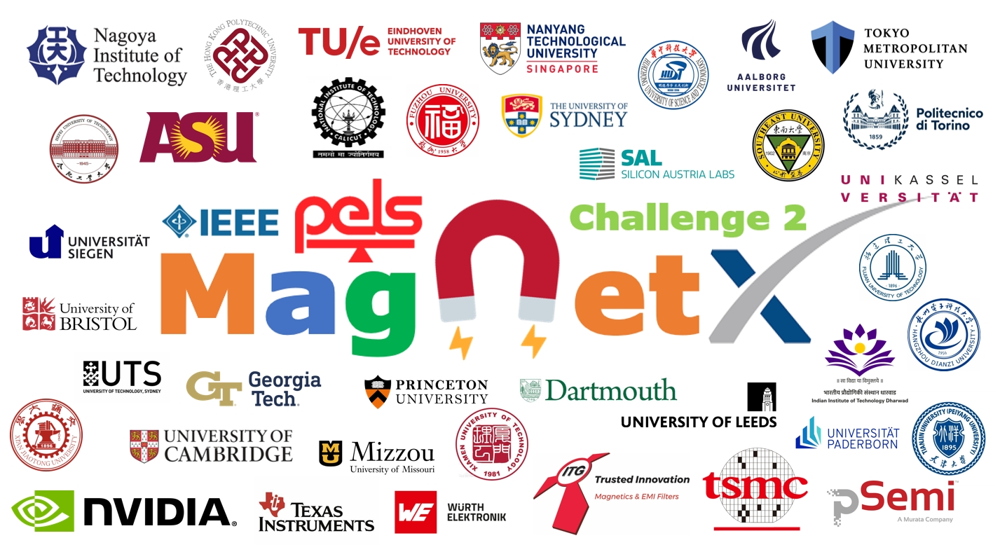

# MagNet Challenge 2 [GitHub](https://github.com/minjiechen/magnetchallenge-2)

## IEEE PELS International Challenge on Design Methodologies [Prize Pool $60,000]
- This site provides the latest information about the MagNet Challenge 2.
- Please contact pelsmagnet@gmail.com for all purposes.
- Sign-Up to MagNet Challenge 2 before May 1st [PDF](docs/SignUpForm-2025.pdf), extended to *May 8th*.
- 2-Page concept proposal due June 1st [PDF](docs/template.pdf), [DOC](docs/template.doc), [Latex](docs/ieeetran.zip), extended to *June 15th*.
- The purpose of the concept proposal is to ensure all teams understand the rules and complete team forming.

## [News #7] Useful Resources
- [Awesome Time Series Papers](https://github.com/TSCenter/awesome-time-series-papers)
- [MagNet Challenge 2 Data](https://www.dropbox.com/scl/fo/o07x7fa6d5elev19pzd1w/AISuBEWf8LQVszFeoaTlqY4?rlkey=8ec7mqukfr9no61h193zb4qdb&dl=0)
- [MagNet Challenge 1 Data](https://www.princeton.edu/~minjie/magnet.html)

## [News #6] MagNet Tutorial Series
- Zoom meetings to introduce baseline models for training and testing. [Sign Up](https://princeton.zoom.us/webinar/register/WN_uGYhxr9qTDe6Sjzm8qzQ9w)
- Time: Every Friday, 9am-10am EST, from May 16th to June 6th (4 times).
- Tutorial 1 (May 16): Data Driven Methods @ [Shukai Wang](https://github.com/PaulShuk). [Video](https://www.youtube.com/watch?v=_EHfbElroiI), [Slides](tutorials/tutorial-1/Slides-Tutorial-1.pdf), [Code](tutorials/tutorial-1)
- Tutorial 2 (May 23): Analytical Methods @ [Thomas Guillod](https://github.com/otvam). [Video](https://www.youtube.com/watch?v=EwesJTd0ZfM), [Slides](tutorials/tutorial-2/Slides-Tutorial-2.pdf), [Code](tutorials/tutorial-2)
- Tutorial 3 (May 30): Testing and Evaluation by @ [Hyukjae Kwon](https://github.com/hk1715). [Video](https://www.youtube.com/watch?v=7nNlPNOmJEA), [Slides](tutorials/tutorial-3/Slides-Tutorial-3.pdf), [Code](tutorials/tutorial-3)
- Tutorial 4 (June 6): Q&A and Brainstorm Sessions by @ [Minjie Chen](https://github.com/minjiechen). [Video](https://www.youtube.com/watch?v=63Z31vTarik), [Slides](tutorials/tutorial-4/Slides-Tutorial-4.pdf)

## [News #5] 39 Teams Confirmed, ✅:Concept Paper Received
- Aalborg University (Zhao), Denmark 🇩🇰 ✅
- Aalborg University (Davari), Denmark 🇩🇰 ✅
- Eindhoven University of Technology, Netherland 🇳🇱 ✅
- Tianjin University, China 🇨🇳 ✅
- Xi'an Jiaotong University (Zhu1), China 🇨🇳 ✅
- Xi'an Jiaotong University (Zhu2), China 🇨🇳 ✅
- Xi'an Jiaotong University (Wei), China 🇨🇳 ✅
- Xi'an Jiaotong University (Chen), China 🇨🇳 ✅
- Fuzhou University, China 🇨🇳 ✅
- Hangzhou Dianzi University, China 🇨🇳 ✅
- Southeast University (Cheng), China 🇨🇳 ✅
- Southeast University (Xu), China 🇨🇳 ✅
- Tsinghua University, China 🇨🇳 ✅
- Fujian University of Technology, China 🇨🇳 ✅
- Hefei University of Technology, China 🇨🇳 ✅
- Huazhong University of Science and Technology, China 🇨🇳 ✅
- University of Electronic Science and Technology of China, China 🇨🇳 ✅
- Zhejiang University, China 🇨🇳 ✅
- The Hong Kong Polytechnic University, Hong Kong SAR 🇭🇰 ✅
- Seigen & Paderborn, Germany 🇩🇪 ✅
- University of Kassel, Germany 🇩🇪 ✅
- TU Munich & FU Santa Catarina, Germany & Brazil 🇩🇪 🇧🇷 ✅
- Leeds & Wuerth Elektronik, UK & Germany 🇬🇧 🇩🇪 ✅
- KU Leuven, Belgium, 🇧🇪 ✅
- University of Bristol, UK 🇬🇧 ✅
- University of Cambridge, UK 🇬🇧 ✅
- Politecnico di Torino, Italy 🇮🇹 ✅
- Tokyo Metropolitan University, Japan 🇯🇵 ✅
- Nagoya Institute of Technology, Japan 🇯🇵 ✅
- Nanyang Technological University (Yang), Singapore 🇸🇬 ✅
- Nanyang Technological University (Tang), Singapore 🇸🇬 ✅
- University of Sydney, Australia 🇦🇺 ✅
- National Institute of Technology Calicut (Mohan), India 🇮🇳 ✅
- National Institute of Technology Calicut (Muhammed), India 🇮🇳 ✅
- Indian Institute of Technology Dharwad, India 🇮🇳 ✅
- Silicon Austria Labs, Austria 🇦🇹 ✅
- Arizona State University, USA 🇺🇸 ✅
- University of Missouri Columbia, USA 🇺🇸 ✅
- Georgia Institute of Technology, USA 🇺🇸 ✅
- Princeton University, USA 🇺🇸 (not competing)
- Dartmouth College, USA 🇺🇸 (not competing)

## [News #4] Sponsors Confirmed
- Nvidia (Top GPUs)
- Texas Instruments ($5000)
- Wurth Electronik ($5000)
- ITG Electronics ($5000)
- pSemi ($5000)
- TSMC ($5000)
- IEEE Power Electronics Society ($35000)
- Princeton University (as much as needed!)

## [News #3] MagNet Challenge 2 - Training Data Release
Training data for 10 materials (the same 10 materials as MagNet Challenge 1):
- [MagNet Challenge 2 Data](https://www.dropbox.com/scl/fo/o07x7fa6d5elev19pzd1w/AISuBEWf8LQVszFeoaTlqY4?rlkey=8ec7mqukfr9no61h193zb4qdb&dl=0)
- [Readme](docs/README.pdf)

You may want to reuse the steady-state data from MagNet Challenge 1:
- [MagNet Challenge 1 Data](https://www.princeton.edu/~minjie/magnet.html)

Note:
* Testing data on 5+ new materials will be released on Nov. 1st;
* Data sequences are sampled at a fixed rate (16 MHz) in different lengths;
* Data sequences in different rows are independent from each other;
* Let us know if you find any problems with the data.

## [News #2] MagNet Challenge 2 - APEC Launch
- Time: 2025-3-19 Wed 2pm EST
- Atlanta Omni Hotel, Room Grand A

## [News #1] MagNet Challenge 2 - Public Launch
- Time: 2025-2-26 Wed 9am EST
- [Zoom Recording](https://www.youtube.com/watch?v=M828SxwGF1s)
- Reading: [Handbook](docs/Handbook-2025.pdf) and [Slides](docs/Slides-2025.pdf)

## Overview

Build upon the success of MagNet Challenge 1, the goal of the MagNet Challenge 2 is to develop intelligent software tools that can learn and predict magnetic characteristics in transient. For each magnetic material of interest, we are looking for a MATLAB or Python function that takes the following three inputs:

-	A pair of B(t) and H(t) waveforms documenting the excitation history from t_0 to t_1;
- A future flux density excitation wave B’(t) from t_1 to t_2;
- Temperature: T.

And produce the following one output:
- The corresponding field strength wave H’(t) from t_1 to t_2 paired with B’(t).

This function should be packaged as: H'(t)=function (B(t),H(t),B'(t),T). 

In order to capture the physical behaviors of the magnetic material in transient, the models should be frequency agnostic (no frequency information), time-step agnostic (short or long time-steps), and initial-state agnostic (always converging after a long time). We encourage using the latest stable version of commonly used MATLAB and Python packages. Analytical methods and machine learning methods are both encouraged.

There are intrinsic correlations between the materials behavior in steady-state and in transient. In fact, a model operates well for transient conditions must operate well in steady states. As a result, student teams are encouraged to reuse the data and models made available for the MagNet Challenge 1 in 2023 and leverage the physical and analytical understandings of the models developed for the MagNet Challenge 1 in 2023 for the MagNet Challenge 2 in 2025.

Please refer to the [Handbook](docs/Handbook-2025.pdf) and [Slides](docs/Slides-2025.pdf) for more details.

## Timeline
- 02-14-2025 Initial Call for Participation Announcement [Handbook](docs/Handbook-2025.pdf) [Slides](docs/Slides-2025.pdf) [SignUp](docs/SignUpForm-2025.pdf) 
- 03-19-2025 APEC Official Annoucement
- 04-01-2025 Training Data for 10 Materials Available
- 05-01-2025 1-Page Letter of Intent Due with Signature 
- 06-01-2025 2-Page Concept Proposal Due [PDF](docs/template.pdf) [DOC](docs/template.doc) [Latex](docs/ieeetran.zip)
- 07-01-2025 Notification of Acceptance
- 08-01-2025 Expert Feedback on the Concept Proposal
- 11-01-2025 Preliminary Submission Due
- 11-01-2025 Testing Data for 5 New Materials Available
- 12-24-2025 Final Submission Due
- 03-01-2026 Winners Selected

## Evaluation
- 06-15-2025 Evaluate the concept proposals and ensure all teams understand the competition rules.
- 11-15-2025 Evaluate the 10 models the teams developed for the 10 materials and provide feedback for improvements.
- 12-31-2025 Evaluate the 5 new models the teams developed for the 5 new materials and announce the winners.

## Judge Committee
- Prof. David Perreault, MIT, USA
- Prof. Jürgen Biela, ETH Zurich, Switzerland
- Prof. Dragan Maksimovic, CU Boulder, USA
- Prof. SY Ron Hui, CityU, Hong Kong
- Prof. Charles Sullivan, Dartmouth, USA

The judging committee will evaluate the results of each team with the following criterias.
- Model accuracy: core loss and B-H trajectory prediction accuracy (lower error better)
- Model size: number of parameters the model needs to store for each material (smaller model better)
- Model explanability: explanability of the model based on existing physical insights (more explainable better)
- Model novelty: new concepts or insights presented by the model (newer insights better)
- Software quality: quality of the software engineering (more concise better)

## Discussions
- Discussion Forum [Link](https://github.com/minjiechen/magnetchallenge-2/discussions)

## Awards (pending)
- Model Performance Award, First Place        $10,000
- Model Performance Award, Second Place       $5,000
- Model Novelty Award, First Place            $10,000
- Model Novelty Award, Second Place           $5,000
- Outstanding Software Engineering Award      $10,000
- Honorable Mentions Award         multiple x $1,000

## Useful Links
- [MagNet Challenge 2 in 2025](https://github.com/minjiechen/magnetchallenge-2) - maintained by Princeton University
- [MagNet Challenge 1 in 2023](https://github.com/minjiechen/magnetchallenge) - maintained by Princeton University
- [MagNet Open Database](https://www.princeton.edu/~minjie/magnet.html) - maintained by Princeton University
- [MagNet-AI Platform](https://mag-net.princeton.edu/) - maintained by Princeton University
- [MagNet Toolkit](https://github.com/upb-lea/mag-net-hub) - maintained by Paderborn University
- [MagNet Engine](https://github.com/moetomg/magnet-engine) - maintained by University of Sydney

## Other Resources
- [MagNet Challenge 1 Homepage](https://minjiechen.github.io/magnetchallenge/)
- [MagNet Challenge 1 GitHub](https://github.com/minjiechen/magnetchallenge)
- [MagNet-AI Platform](https://mag-net.princeton.edu/)
- [MagNet-AI GitHub](https://github.com/PrincetonUniversity/Magnet)
- [Princeton Power Electronics Research Lab](https://www.princeton.edu/~minjie/magnet.html)
- [Dartmouth PMIC](https://pmic.engineering.dartmouth.edu/)
- [ETHz PES](https://pes.ee.ethz.ch/)
- [MagNetX](https://github.com/PaulShuk/MagNetX)

## Reference Papers
- M. Chen, H. Li, S. Wang, T. Guillod, D. Serrano, N. Forster, W. Kirchgassner, T. Piepenbrock, O. Schweins, O. Wallscheid, Q. Huang, Y. Li, Y. Dou, B. Li, S. Li, E. Havugimana, V. T. Chacko, S. Radhakrishnan, M. Ranjram, B. Sauter, S. Reese, S. Sinha, L. Zhang, T. McKeague, B. Cui, N. Rasekh, J. Wang, S. Liu, A. Martinez, X. Liu, C. Mei, R. Zhao, G. Wu, H. Wu, R. Zhang, H. Song, L. Zhang, Y. Lu, L. Hang, N. Rajput, H. B. Sandhibigraha, N. Agrawal, V. M. Iyer, X. Shen, F. Tian, Q. Sui, J. Kong, W. Martinez, A. Arruti, B. Alberdi, A. Agote, I. Aizpuru, M. Zhang, X. Chen, Y. Dong, D. Wang, T. Shen, Y. Zhou, Y. Li, S. Wang, Y. Wu, Y. Jiang, Z. Xiao, Y. Tang, Y.-S. Hsieh, J.-D. Li, L.-C. Yu, T.-C. Hsu, Y.-C. Liu, C.-H. Hsia, C. Chen, A. Giuffrida, N. Lombardo, F. Marmello, S. Morra, M. Pasquale, L. Solimene, C. S. Ragusa, J. Reynvaan, M. Stoiber, C. Li, W. Qin, X. Ma, B. Zhang, Z. Wang, M. Cheng, W. Xu, J. Wang, Y. Hu, J. Xu, Z. Shi, D. B. Sapkota, P. Neupane, M. Joshi, S. Khan, B. Su, Y. Xiao, M. Yang, K. Sun, Z. Li, R. Mirzadarani, R. Liu, L. Wang, T. Luo, D. Lyu, M. G. Niasar, Z. Qin, S. I. A. Meerza, K. Froehle, H. H. Cui, D. Costinett, J. Liu, Z. Liu, C. Zhan, Y. Dang, Y. Zhang, N. Wang, Y. Chen, Y. Zhang, C. Li, Y. Yao, T. Hu, L. Xu, Y. Wang, S. Wang, S. Jiang, D. Shumacher, D. Maksimovic, R. S. Y. Hui, J. W. Kolar, D. J. Perreault, and C. R. Sullivan, "Magnet Challenge for Data-Driven Power Magnetics Modeling," in IEEE Open Journal of Power Electronics, doi: 10.1109/OJPEL.2024.3469916. [Paper](https://ieeexplore.ieee.org/document/10699398)
- S. Wang, H. Kwon, H. Li, et al. "MagNetX: Foundation Neural Network Models for Simulating Power Magnetics in Transient," IEEE Applied Power Electronics Conference and Exposition (APEC), Atlanta, GA, USA, 2025, pp. 2438-2445. [Paper](https://ieeexplore.ieee.org/document/10977420)
- H. Kwon, S. Wang, H. Li, et al. "MagNetX: Extending the MagNet Database for Modeling Power Magnetics in Transient," IEEE Applied Power Electronics Conference and Exposition (APEC), Atlanta, GA, USA, 2025, pp. 566-572. [Paper](https://ieeexplore.ieee.org/document/10977252)
- D. Serrano et al., "Why MagNet: Quantifying the Complexity of Modeling Power Magnetic Material Characteristics," in IEEE Transactions on Power Electronics, doi: 10.1109/TPEL.2023.3291084. [Paper](https://ieeexplore.ieee.org/document/10169101)
- H. Li et al., "How MagNet: Machine Learning Framework for Modeling Power Magnetic Material Characteristics," in IEEE Transactions on Power Electronics, doi: 10.1109/TPEL.2023.3309232. [Paper](https://ieeexplore.ieee.org/document/10232863)
- H. Li, D. Serrano, S. Wang and M. Chen, "MagNet-AI: Neural Network as Datasheet for Magnetics Modeling and Material Recommendation," in IEEE Transactions on Power Electronics, doi: 10.1109/TPEL.2023.3309233. [Paper](https://ieeexplore.ieee.org/document/10232911)

## Organizers

